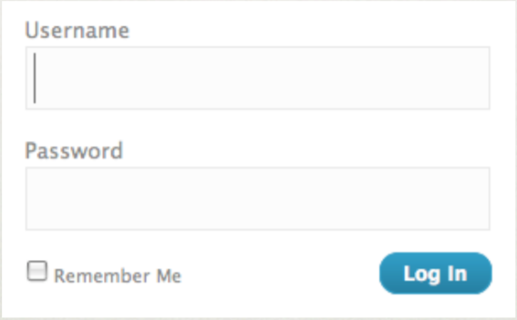

---
title: "Login Screen - Tips and Ideas for Testing"
date: "2020-10-28"
author: "Sudhey Sharma"
coverImage: "CoverImage.png"
tags: ["LoginScreen", "TestingTips"]
description: "Login process is the most important feature for any system/application as it provide access to an entire **web-site / application** or part of it. This article is providing you with some important tips & ideas about login testing."
---

**

## Login Screen - Tips and Ideas for Testing

**

A **login screen** is a web **page** or an entry **page** to a web/mobile application that requires user identification and authentication, regularly performed by entering a username and password combination. 
Login process is the most important feature for any system/application as it provide access to an entire **web-site / application** or part of it. So, testing of login screen need complete coverage. 

Mentioned below are few tips that can be referred for testing the login screen of any system/application.

**UI/UX:**

 - Tab Order - Check if there is a logical order for using the tab key
 - Focus on Username field - Check if, while landing on the page, the cursor is at the username field 
 - Use of enter key - Check if Login button is activated on selecting enter
 - Accessibility - Check if all the fields in the page are correctly identified and labelled
 - Look & Feel - Check if the page looks fine and everything is aligned correctly.
 - Content - Check if the content of the page is up to the mark. Is there any typos in the labels, controls of the screen?
 - Links - Check if the page contains any existing links and are these links still valid.
 - Responsiveness - Check the responsiveness of the login screen in multiple size of computer-monitors.

**Security Checks:**

 - Password - Check if the password shown or hidden(using asterisks)
 - Password - Check if you can copy & paste the password from other applications.
 - Password - Check if there is a minimum complexity on the password
 - Password - Check if there is 'Show password' option is there or not. If yes, then sheck if it is working fine.
 - Common Password Lookup - Check if the login screen ia performing a lookup in the list of the most common passwords ([CommonPasswordsList](https://en.wikipedia.org/wiki/List_of_the_most_common_passwords))
 - View Source - Check the source code of the application and check if any valuable information given away in the HTML source code
 - SQL Injection - Check if the login page is vulnerable to SQL input
 - Pages - Check if you are able to access the other pages of the application without logging in.  
 - URL Manipulation - Check if you are able to access the other pages of the application by editing the URLs, to gain access where it should not be allowed (without login).
 - Multiple accounts - Check if by using different accounts, you can logged in at the same time in the same browser
 - Cookies - Check if you can edit and/or disable the cookies.

**Functionality:**

 - Login - Check the login functionality with valid/invalid credentials and without providing credentials.
 - Logout - Check the log-out functionality. Check on logging out, the user is logging out completely.
 - Forgot password - Check if the forgot password option is available or not. And if it is there, does it work correctly. Also check if it is prone to security failure or URL manipulation
 - Back and Forward buttons - Check how does the application cope when using the browser's 'Back' and 'Forward' buttons.
 - Remember me - Check if there is a “Remember me” option. And if it is present, then does it work as standard. Also check what ahppens if password is changed.
 - Compatibility - Check the Login/Logout functionality with all possible valid/invalid cases in other browsers.
 - Data - Check the username & password fields for data validation (Is there a minimum or maximum length of characters, boundary-values, what are the allowed characters etc.).
 - Error handling - Check how various errors are handled and displayed (for negative cases).
 - Javascript-off test - Check if the login form still work when JavaScript is disabled.
 - 2FA Check - Check the login process when two-factor authentication is being provided; then test with valid/invalid token, test with valid/invalid backup code, test lockout procedure, and test recovery process.

**Thanks for reading and happy testing!**

